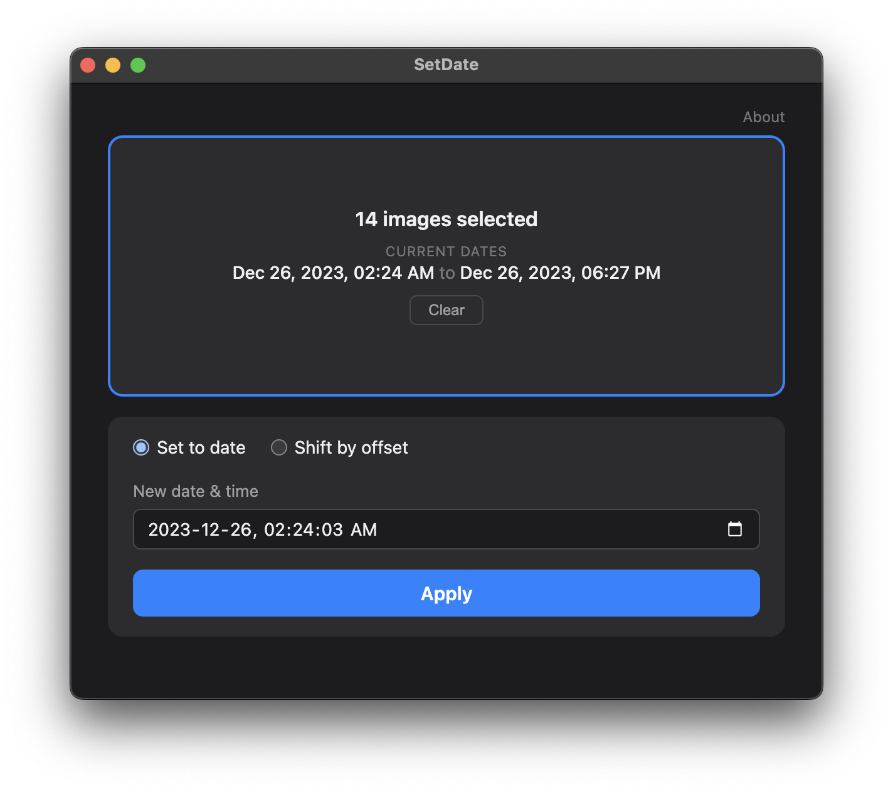

# SetDate

A simple macOS tool for batch-updating creation dates on images. Drag in files or a folder, pick a new date (or shift by an offset), and hit Apply.

Sets all three EXIF date fields (DateTimeOriginal, CreateDate, ModifyDate) plus the macOS filesystem creation date, so Finder, Photos, and every other app agree.

Supports JPG, PNG, TIFF, HEIC, WebP, and common RAW formats.



## Install

1. Download the latest `.dmg` from [Releases](https://github.com/topherhunt/setdate/releases) -- `Apple-Silicon` for M-series Macs, `Intel` for older ones. (Apple menu > About This Mac will tell you which you have.)
2. Open the `.dmg` and drag **SetDate** into your Applications folder.
3. **First launch only:** right-click (or Control-click) SetDate in Applications and choose **Open**, then click **Open** in the dialog that appears. After that, it opens normally on a double-click.

That extra step exists because SetDate isn't notarized -- notarization requires a paid Apple Developer account, and this is a free app. macOS shows an "unidentified developer" warning for any app in that position.

If macOS instead tells you the app is **damaged and should be moved to the Trash**, you have an old build with a broken code signature. Download the latest release, which fixes it.

A Windows installer (`.exe`) is also published with each release. macOS is the primary target and gets the most testing.

## Development

```
npm install
npm start
```

## Tests

```
npm test
```

## Build

```
npm run dist       # Apple Silicon .dmg only -- the quick local build
npm run dist:mac   # both .dmgs, as the release workflow builds them
npm run dist:win   # Windows .exe installer (run on Windows)
```

The two macOS builds run as separate electron-builder invocations so each can name its own artifact (`SetDate-<version>-Apple-Silicon.dmg` / `-Intel.dmg`). electron-builder's `${arch}` macro only expands to `arm64`/`x64`, and it omits the suffix entirely for x64, which left the Intel build looking like the default download.

Output lands in `dist/`. macOS builds are re-signed ad-hoc by `scripts/after-pack.js`, which then verifies the signature and fails the build if it doesn't match the bundle -- without that, macOS reports the app as damaged.

## Releasing

Push a version tag to build both platforms and open a draft GitHub Release:

```
npm version minor      # bumps package.json and creates the tag
git push && git push --tags
```

Review and smoke-test the attached artifacts, then publish the draft. See [.github/workflows/release.yml](.github/workflows/release.yml).

## Make your own

You don't need to trust my code. This app was built entirely with [Claude Code](https://claude.ai/code), and you can do the same -- fork this repo and modify it, or start from scratch with your own version.

The easiest way: point Claude Code at this project's [CLAUDE.md](https://github.com/topherhunt/setdate/blob/main/CLAUDE.md), which describes the architecture, features, and code style. Then tell it what you want to change. For example:

```
Read https://github.com/topherhunt/setdate/blob/main/CLAUDE.md for context,
then build me a version that also supports [your feature here].
```

Or just use it as inspiration and build something completely different. The point is: simple apps like this are easy to create, verify, and customize with AI assistance.

## License

MIT -- free to use, modify, and redistribute, including in commercial projects. No permission needed, no strings attached. See [LICENSE](LICENSE) for the full text.
